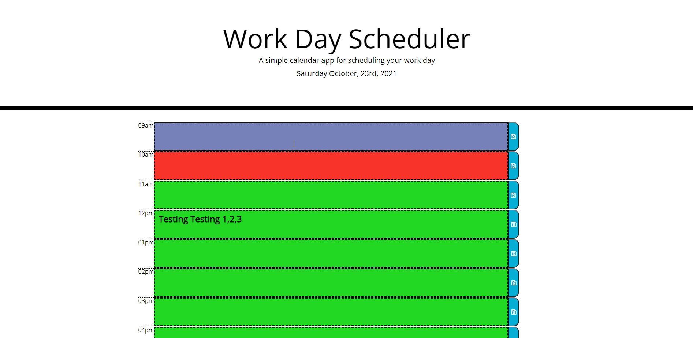

# Work-Day-Scheduler
Welcome to the README for my Work-Day-Scheduler web application.

Using this application you will be able to save a schedule for your current 9-5 workday!

In this web application I used the skills I have obtain thus far in my 

coding bootcamp. Using bootstrap and jquery to make my javascript work. I added

the current day time with moment. When the time of the day has passed the time of

the day when you had something scheduled, the text box for that hour will turn red.

If the time in the text box is current it will be green. When you save your text and reload

the browser your text will return as it was saved.

[work-day-scheduler deployed](https://veidul.github.io/Work-Day-Scheduler/)
